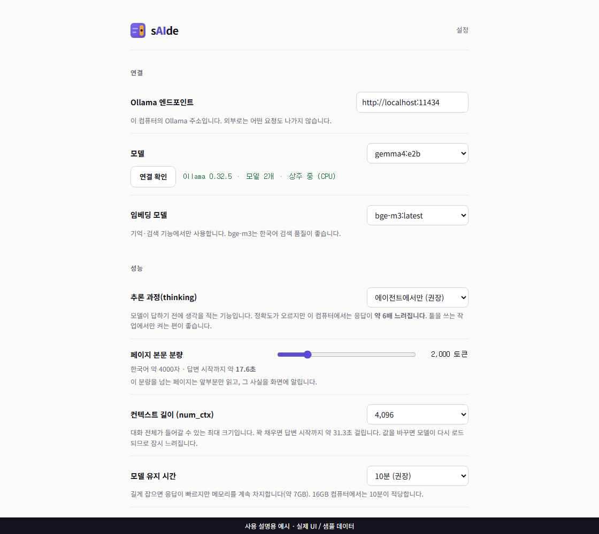
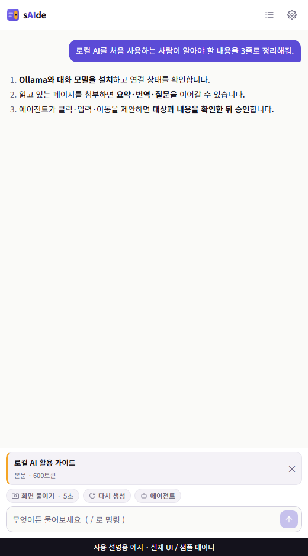
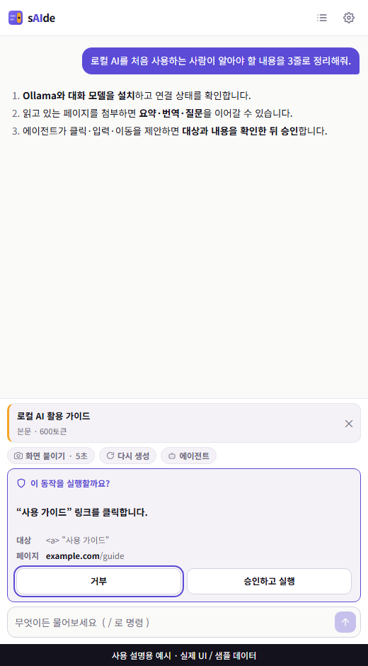
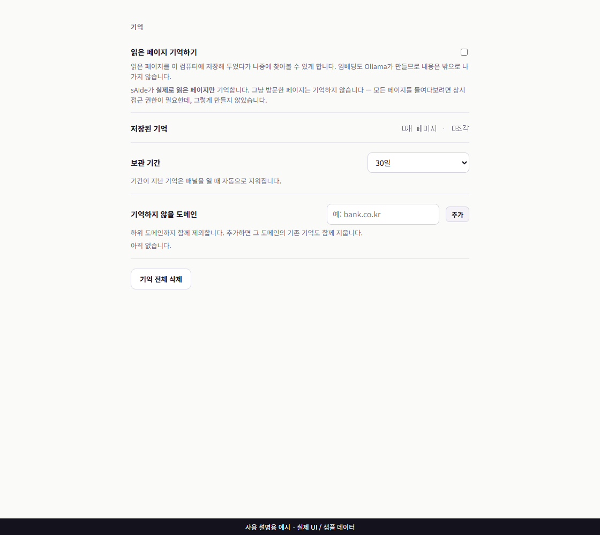
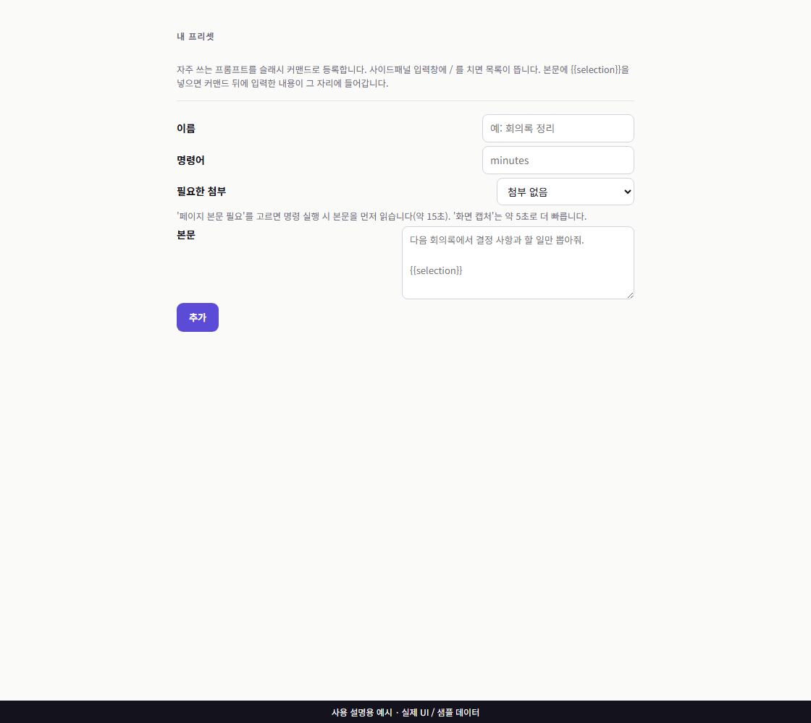

# sAIde — 옆에서 돕는 AI

**내 컴퓨터의 Ollama 모델로 웹페이지를 요약·번역하고, 질문하고, 승인 후 페이지를 조작하는 Chrome 확장 프로그램입니다.** 브라우저 오른쪽 사이드패널에서 사용합니다.

문서 기준: **2026-09-12 · 소스 버전 0.1.0**. 현재 배포 형태는 소스를 빌드해 설치하는 개발자 모드 확장입니다. 이 저장소에는 Chrome 웹스토어 공개 배포를 확인할 링크가 없습니다.

## 목차

- [할 수 있는 일](#할-수-있는-일)
- [설치하기](#설치하기)
- [처음 연결하기](#처음-연결하기)
- [화면과 기본 사용법](#화면과-기본-사용법)
- [페이지 요약과 번역](#페이지-요약과-번역)
- [화면 캡처와 에이전트](#화면-캡처와-에이전트)
- [기억과 사용자 프리셋](#기억과-사용자-프리셋)
- [설정 안내](#설정-안내)
- [개인정보와 데이터 관리](#개인정보와-데이터-관리)
- [문제 해결](#문제-해결)
- [개발 및 검증](#개발-및-검증)

## 할 수 있는 일

| 기능 | 사용 예 | 필요한 것 |
|---|---|---|
| 일반 대화 | “이 개념을 쉽게 설명해줘” | Ollama와 대화 모델 |
| 페이지 요약·질문 | 기사 핵심 3줄, 문서에 대해 후속 질문 | 해당 사이트 접근 허용 |
| 페이지 번역 | `/translate 영어` | 읽을 수 있는 본문 |
| 선택 문장 처리 | 문장 선택 → 우클릭 → 번역·설명·다듬기 | 일반 웹페이지 |
| 화면 설명 | 차트·대시보드의 현재 보이는 화면 설명 | 비전 지원 모델, 캡처 권한 |
| 에이전트 | 페이지 읽기·요소 찾기·스크롤·클릭·입력·이동 | 도구 호출 지원 모델, 실행 권한 |
| 기억 검색 | `/기억 전에 읽은 로컬 AI 글` | 기억 활성화, 임베딩 모델 |
| 사용자 프리셋 | 반복해서 쓰는 지시를 `/명령어`로 등록 | 설정 화면 |

모델이 내놓는 답은 틀릴 수 있습니다. 본문이 잘렸다는 표시가 있으면 읽힌 범위만 답변 근거가 됩니다. PDF 뷰어, 브라우저 내부 화면, iframe·Shadow DOM·캔버스 중심 앱은 일반 HTML 본문처럼 읽거나 조작되지 않을 수 있습니다.

## 설치하기

### 1. 준비물

| 항목 | 안내 |
|---|---|
| 브라우저 | 데스크톱 Chrome. 코드가 `sidePanel.open()`을 사용하므로 API 기준 Chrome 116 이상이 필요합니다. 최신 안정 버전을 사용하세요. |
| Node.js / npm | **Node 24.x / npm 11.x**. 검증 및 `.nvmrc` 기준은 Node **24.18.0**, packageManager는 npm **11.16.0**입니다. |
| Ollama | 이번 로컬 API 검증 버전은 **0.32.5**입니다. 다른 버전의 호환성은 별도 확인이 필요합니다. |
| 모델·저장 공간 | 기본 대화 모델 `gemma4:e2b`는 이번 설치본 기준 약 7.16 GB, 선택 임베딩 모델 `bge-m3:latest`는 약 1.16 GB입니다. 다운로드·실행 여유 공간이 추가로 필요합니다. |
| 메모리 | 모델, 컨텍스트, 다른 프로그램에 따라 달라집니다. 기존 개발 기록은 RAM 약 16 GB의 CPU 환경을 기준으로 합니다. GPU는 필수가 아니며 CPU에서는 응답이 느릴 수 있습니다. |

Node.js는 [공식 다운로드](https://nodejs.org/en/download), Ollama는 [공식 다운로드](https://ollama.com/download)에서 설치합니다. 브라우저 요구 근거는 [Chrome Side Panel API](https://developer.chrome.com/docs/extensions/reference/api/sidePanel)입니다.

### 2. Ollama와 모델 준비

Ollama 앱을 실행한 뒤 터미널에서 확인합니다.

```powershell
ollama --version
ollama pull gemma4:e2b
ollama list
```

기억 기능을 사용할 때만 임베딩 모델을 추가합니다.

```powershell
ollama pull bge-m3
```

Ollama 앱이 서버를 실행하고 있다면 `ollama serve`를 별도로 실행할 필요가 없습니다. 앱을 사용하지 않는 환경에서는 터미널에서 `ollama serve`를 실행한 상태로 둡니다.

Windows PowerShell에서 연결을 확인합니다.

```powershell
Invoke-RestMethod http://localhost:11434/api/version
Invoke-RestMethod http://localhost:11434/api/tags
```

macOS/Linux에서는 `curl http://localhost:11434/api/version`을 사용할 수 있습니다. 버전 JSON이 나오면 서버가 응답하는 것입니다. 이것만으로 **Chrome 확장에서의 CORS 연결까지 확인되는 것은 아닙니다.**

### 3. 확장 빌드

저장소를 내려받고, `package.json`이 있는 폴더에서 실행합니다. 아래 첫 줄의 경로는 실제 내려받은 위치로 바꾸세요.

```powershell
cd D:\Dev\sAIde
npm ci
npm run compile
npm test
npm run build
```

`npm ci`는 잠금 파일에 맞춰 의존성을 설치하고 `wxt prepare`를 실행합니다. 빌드가 성공하면 **`.output/chrome-mv3`** 폴더에 `manifest.json`, `sidepanel.html`, `options.html` 등이 생성됩니다. Node.js와 npm은 빌드 도구이며, 빌드한 확장을 사용할 때 개발 서버를 계속 켜 둘 필요는 없습니다.

### 4. Chrome에 설치

1. 주소창에 `chrome://extensions`를 입력합니다.
2. 오른쪽 위 **개발자 모드**를 켭니다.
3. **압축해제된 확장 프로그램을 로드합니다**를 누릅니다.
4. 프로젝트 루트가 아닌 **`.output/chrome-mv3` 폴더**를 선택합니다.
5. sAIde 카드가 나타나면 Chrome 툴바의 확장 프로그램 메뉴에서 sAIde를 고정합니다.
6. 일반 웹페이지를 열고 sAIde 아이콘을 눌러 패널을 엽니다.

기본 단축키는 **Ctrl+Shift+S**입니다. 다른 확장과 충돌하거나 OS에서 다르게 배정되면 `chrome://extensions/shortcuts`에서 확인·변경하세요.

업데이트할 때는 소스를 갱신하고 `npm ci`, `npm run build`를 실행한 다음 확장 관리 화면에서 sAIde의 **새로고침**을 누르고 패널과 대상 페이지를 다시 엽니다. 데이터 유지를 위해 기존 확장을 제거하지 말고 같은 경로에서 갱신하세요.

## 처음 연결하기

1. 패널 위쪽 **톱니바퀴**로 설정을 엽니다.
2. Ollama 주소를 기본값 **`http://localhost:11434`**로 둡니다. 끝에 `/api`를 붙이지 않습니다.
3. **연결 확인**을 누릅니다.
4. 대화 모델에서 설치한 **`gemma4:e2b`**를 선택합니다.
5. 기억을 사용할 때는 임베딩 모델에서 **`bge-m3:latest`**를 선택합니다.
6. 패널로 돌아와 “안녕하세요. 한 문장으로 답해주세요.”를 전송합니다.



> 이 매뉴얼의 PNG는 **실제 소스의 React 컴포넌트를 문서용 별도 환경에서 실행해 캡처한 화면**입니다. 대화·연결 상태는 샘플 데이터이며, Chrome 확장 설치·권한 팝업·실제 모델 응답을 캡처한 것은 아닙니다. 브라우저 연결 도구 오류로 확장 자체의 화면 캡처는 완료하지 못했습니다. [캡처 재현 방법](docs/screenshots/README.md)을 참고하세요.

### CORS 오류가 나타날 때

확장 origin을 Ollama가 허용하도록 설정한 후 **Ollama를 완전히 종료하고 재시작**합니다. Windows에서는 다음처럼 사용자 환경 변수로 설정할 수 있습니다.

```powershell
[Environment]::SetEnvironmentVariable('OLLAMA_ORIGINS', 'chrome-extension://*', 'User')
```

`chrome-extension://*`는 모든 Chrome 확장 origin을 허용하는 패턴입니다. sAIde만 허용하려면 `chrome://extensions`에 표시되는 sAIde의 ID를 사용해 `chrome-extension://실제확장ID`로 지정하세요. 기존에 필요한 허용 origin이 있다면 덮어쓰기 전에 함께 유지할 값을 확인하세요.

macOS 앱은 `launchctl setenv OLLAMA_ORIGINS "chrome-extension://실제확장ID"` 후 재시작합니다. Linux systemd 서비스는 `sudo systemctl edit ollama.service`의 `[Service]`에 `Environment="OLLAMA_ORIGINS=chrome-extension://실제확장ID"`를 추가하고 서비스를 재시작합니다. 서비스 설치 방식에 따른 자세한 절차는 [Ollama FAQ](https://docs.ollama.com/faq)를 참고하세요. 로컬 사용을 위해 서버를 `0.0.0.0`에 공개할 필요는 없습니다.

## 화면과 기본 사용법



| 위치 | 역할 |
|---|---|
| 상단 도구 모음 | 대화 제목, 대화 목록, 설정 |
| 현재 페이지 영역 | 대상 페이지 확인, 요약·핵심 3줄·번역 등 실행 |
| 페이지 첨부 표시 | 제목, 추출 방식, 대략의 토큰 수, 잘림 여부. ×로 분리 |
| 대화 영역 | 질문과 답변, Markdown·표·코드, 추론 및 실행 기록 |
| 입력 영역 | 질문 입력, 화면 첨부, 에이전트 전환, 전송·중단 |
| 상태 표시 | 모델·연결·CPU/GPU 등의 상태 |

일반 질문을 입력하고 **Enter**로 전송합니다. **Shift+Enter**는 줄바꿈입니다. 한글 입력 조합 중에는 Enter가 전송으로 처리되지 않도록 구현되어 있습니다. 생성 중 **중단**으로 멈출 수 있고, 답변을 다시 받고 싶으면 **재생성**을 사용합니다. 재생성은 기존 마지막 답변부터 이후 기록을 지우고 일반 대화 경로로 다시 생성합니다.

대화는 로컬에 저장됩니다. 탭이나 페이지 주소가 바뀌면 해당 문서의 대화로 전환되며 기존 페이지·화면 첨부는 분리됩니다. 이전 대화는 목록에서 다시 열 수 있습니다. **첨부 본문과 스크린샷 자체는 대화 메시지처럼 영구 저장되지 않으므로**, 기록을 다시 열었을 때 페이지를 근거로 답하게 하려면 다시 첨부하세요. 대화 목록에는 최근 50건이 표시됩니다.

## 페이지 요약과 번역

1. 읽을 기사나 문서가 있는 일반 웹페이지로 이동합니다.
2. **이 페이지 요약** 또는 **핵심 3줄**을 누릅니다.
3. Chrome이 사이트 접근 허용을 요청하면 대상 사이트를 확인하고 허용합니다.
4. 페이지 첨부 표시를 확인하고 결과를 읽습니다.
5. “이 중 장점과 단점을 표로 비교해줘”처럼 후속 질문을 이어갑니다.

**이 페이지에 대해 질문**은 본문을 붙여 두는 기능입니다. 그다음 입력창에 원하는 질문을 작성하세요. 같은 URL의 첨부는 캐시 보존을 위해 유지되므로, 동적으로 바뀐 내용을 새로 읽으려면 첨부를 ×로 분리하고 다시 붙입니다.

| 명령 | 사용 예 |
|---|---|
| `/summary` | `/summary 핵심 주장과 근거를 구분해줘` |
| `/three`, `/3` | `/three` |
| `/translate`, `/번역`, `/tr` | `/translate 영어` 또는 `/번역 일본어로` |
| `/screenshot`, `/screen`, `/capture`, `/shot` | `/screen` |
| `/기억`, `/recall`, `/memory` | `/기억 전에 읽은 로컬 AI 설치 방법` |
| `/explain` | `/explain 설명할 문장` |
| `/polish` | `/polish 다듬을 문장` |

`/`를 입력하면 자동완성 목록을 볼 수 있습니다. 번역 대상 언어를 생략하면 한국어로, 원문이 한국어이면 영어로 번역하도록 요청합니다. 긴 본문은 읽기 예산에서 잘릴 수 있고 번역 결과도 컨텍스트 한도로 짧아질 수 있습니다. 분량을 나누거나 설정의 컨텍스트를 조정하세요.

선택한 문장만 처리하려면 웹페이지에서 문장을 선택한 후 우클릭하여 sAIde의 **번역·설명·다듬기·보내기** 메뉴를 사용합니다. 보내기는 입력창에 넣고, 나머지는 프리셋 요청을 실행합니다. 우클릭 메뉴 언어는 Chrome 언어를 따릅니다.

YouTube는 자막 추출을 먼저 시도하고 실패하면 읽을 수 있는 페이지 텍스트로 대체합니다. 자막이 없거나 접근할 수 없는 영상의 전체 내용을 이해했다고 가정하지 마세요.

## 화면 캡처와 에이전트

### 현재 화면 설명

카메라 버튼 또는 **화면 보고 설명**을 사용합니다. 캡처는 전체 스크롤 문서가 아닌 **현재 보이는 탭의 영역**입니다. 본문 읽기와 달리 이 구현은 캡처 시작 시 **모든 사이트 접근 권한**을 요청합니다. 페이지 본문만으로 충분하면 사이트별 권한으로 요약·질문을 사용할 수 있습니다.

비전 입력을 지원하는 모델이 필요합니다. 모델 선택 UI는 비전 지원 여부를 강제 검증하지 않습니다. 캡처 전에 대상 탭을 확인하고 완료될 때까지 탭·창을 전환하지 마세요. 현재 코드는 캡처 요청의 `tabId`와 실제 활성 탭을 대조하지 않는 문제가 있습니다.

### 승인형 에이전트

1. 설정에서 에이전트 사용이 켜져 있는지 확인합니다(기본 켜짐).
2. 일반 웹페이지를 열고 입력 영역의 **에이전트**를 켭니다.
3. 요청되는 대상 사이트 권한을 확인합니다. 에이전트 시작은 사이트별 권한을 확보합니다. 캡처 도구는 별도로 모든 사이트 권한이 필요하므로, 권한을 미리 주지 않았다면 실패할 수 있습니다.
4. “이 페이지에서 사용 가이드 링크를 찾아줘”처럼 작고 구체적인 작업을 요청합니다.
5. 클릭·입력·이동 전에 승인 카드의 **행동, 대상, 페이지**를 확인하고 승인 또는 거부합니다.



| 도구 | 동작 | 행동 승인 |
|---|---|---|
| `read_page` | 페이지 본문 읽기 | 없음 |
| `find_element` | 요소 검색 | 없음 |
| `scroll` | 화면 스크롤 | 없음 |
| `screenshot` | 보이는 화면 캡처 | 없음(브라우저 권한은 별도) |
| `list_tabs` | 현재 창의 최대 20개 탭을 모델에 전달 | 없음 |
| `click` | 요소 클릭 | 매번 필요 |
| `type_text` | 입력 칸 값 변경 | 매번 필요 |
| `navigate` | HTTP/HTTPS 주소로 이동 | 매번 필요 |

자동 승인은 없습니다. 승인 카드에서 **Esc는 거부**이며 기본 포커스도 거부입니다. 기본 최대 8턴이고 같은 행동·인자 조합은 3회 실행 후 다음 반복에서 중단합니다. 30초 무응답 제한은 전체 작업 시간이 아니라 **모델 출력이 없는 시간**입니다.

도구 요청과 대상 확인은 기본 15초 제한이며, 중단 시 취소를 전달하고 늦은 결과를 무시합니다. 승인 토큰은 120초 동안 한 번만 사용할 수 있습니다. 승인한 문서·요소·행동이 달라지거나 만료되면 실행을 거부하므로 다시 요청하세요. **이미 실행된 클릭·입력은 중단으로 되돌아가지 않습니다.** 실행 기록의 성공은 DOM 호출 성공이며 웹서비스 저장·전송 완료까지 보증하지 않습니다. Tab/Shift+Tab은 승인 버튼 사이를 이동하고 창을 닫으면 이전 포커스를 복구합니다.

에이전트는 모델의 `tools`, 화면을 모델에 보낼 때는 `vision` 기능을 확인합니다. 지원 여부를 확인할 수 없으면 설정에서 해당 기능을 지원하는 모델을 선택하세요. 요청한 탭이 비활성화되거나 캡처 중 바뀌면 화면을 버리고 재시도를 안내합니다.

## 기억과 사용자 프리셋

### 읽었던 페이지를 기억하기



1. `ollama pull bge-m3`로 임베딩 모델을 설치합니다.
2. 설정에서 임베딩 모델을 선택하고 **기억 기능**을 켭니다(기본 꺼짐).
3. 요약·질문으로 sAIde에 페이지를 읽힙니다.
4. 대화를 멈춘 뒤 유휴 시간에 임베딩이 저장됩니다. 큐는 약 8초를 기다리고, 한 페이지당 최대 4개 조각을 만듭니다.
5. `/기억 찾고 싶은 내용`으로 검색합니다. 상위 최대 5개 페이지의 발췌를 근거로 답하도록 요청합니다.

모든 방문 기록을 수집하지 않습니다. **패널이 읽어 첨부한 본문만** 저장 대상이며 페이지 끝까지 보관된다는 보장도 없습니다. 패널을 닫으면 대기 큐가 없어지고, 임베딩 실패는 현재 콘솔에만 표시됩니다. 저장 개수를 확인하세요.

보관 기간은 7·30·90일 또는 무기한입니다. 기간이 지난 기록은 **기억을 껐더라도** 삭제합니다 — 보관 기간은 "앞으로 모으지 않는다"가 아니라 "이만큼만 갖고 있겠다"는 약속이기 때문입니다. 실제 삭제는 사이드패널을 열 때, 그리고 설정의 기억 화면을 열거나 보관 기간을 바꿀 때 수행합니다. 검색할 때도 만료된 기록을 제외합니다. 두 화면을 한동안 열지 않으면 그사이에는 삭제가 일어나지 않습니다. 제외 도메인은 `example.com`처럼 입력합니다. `mail.example.com` 등 하위 도메인의 신규 저장과 기존 기록 삭제에도 적용됩니다.

기억을 끄는 것과 기존 기억 삭제는 별개입니다. 끄더라도 보관 기간 안의 기록은 그대로 남고, 기간이 지난 것만 지워집니다. 제외·끄기·전체 삭제 시 이전에 시작된 임베딩은 저장 직전 정책 검사를 통과하지 못하므로 삭제한 기록을 다시 저장하지 않습니다. **앞으로도 저장하지 않으려면 기억을 끄고 기억 전체 삭제를 실행하세요.** 기억을 켠 채 전체 삭제만 하면 이후 새로 읽힌 페이지는 다시 저장할 수 있습니다. 검색은 모델·벡터 차원이 맞고 유사도 기준을 넘는 기록만 사용합니다.

### 반복 요청을 프리셋으로 저장하기



설정의 사용자 프리셋에서 이름, 슬래시 명령, 필요한 첨부물, 프롬프트 본문을 입력하고 **추가**합니다. 예를 들어 이름 `장단점 비교`, 명령 `compare`, 필요한 첨부물 `페이지`, 본문 `이 페이지의 제안을 장점·단점·주의점 표로 정리해줘.`를 등록하면 `/compare`로 재사용할 수 있습니다. 선택 텍스트형 템플릿에는 `{{selection}}`을 사용할 수 있습니다. 이미 쓰는 명령과 충돌하면 다른 이름을 선택하세요.

## 설정 안내

변경 사항은 자동 저장됩니다. 기본값은 `src/lib/storage/settings.ts`에 정의되어 있습니다.

| 설정 | 기본값 | 의미 |
|---|---|---|
| Ollama 주소 | `http://localhost:11434` | LLM 요청 대상. 로컬 사용을 전제로 하며 원격 주소를 입력하면 데이터 경로가 바뀝니다. |
| 대화 모델 | `gemma4:e2b` | 설치된 정확한 태그를 선택 |
| 임베딩 모델 | `bge-m3` | 목록에는 `bge-m3:latest`로 표시될 수 있음 |
| Thinking | 에이전트에서만 | 일반 대화의 추론 비용을 줄임 |
| 페이지 읽기 예산 | 2,000 토큰 | 500~8,000. 본문의 최대 추정 분량 |
| 컨텍스트 | 4,096 | 2,048~32,768 선택. 입력과 출력에 필요한 모델 문맥 크기 |
| 모델 상주 시간 | 10분 | 5분·10분·30분·계속 |
| 패널 열 때 워밍업 | 켜짐 | 모델 로드를 미리 요청 |
| Temperature | 0.7 | 0~1.5. 낮을수록 출력 변동을 줄이는 방향 |
| 에이전트 최대 턴 | 8 | 2~12 |
| 에이전트 무응답 제한 | 30초 | 20·30·60·120초 |
| 기억 | 꺼짐, 30일 보관 | 사용자가 켜야 신규 저장 |
| 표시 | 시스템 테마, 한국어 | 밝게·어둡게·시스템 및 한국어·영어 |

본문 예산을 컨텍스트보다 크게 설정할 수 있는 상태이므로 무작정 늘리지 마세요. 기본값부터 사용하고 긴 문서의 일부를 나눠 질문하는 편이 예측하기 쉽습니다. 화면에 나오는 예상 시간은 과거 CPU 측정값(프리필 131 tok/s 등)을 이용한 추정이며 현재 PC 실측값이 아닙니다. 설정의 성능 기록은 실제 대화에서 저장한 지표를 보여줍니다.

현재 설정 화면 자체는 언어 설정과 번역 저장소 연결이 빠져 있어 영어 선택이 즉시 반영되지 않을 수 있습니다. 패널의 언어 변경과 구분되는 알려진 문제입니다. 기본값 복원은 설정만 복원하며 대화·기억·프리셋·사이트 권한을 전부 초기화하는 기능이 아닙니다.

## 개인정보와 데이터 관리

기본 설정에서 모델 요청은 이 컴퓨터의 Ollama로 갑니다. 소스에서 분석·추적용 외부 서비스는 확인되지 않았습니다. 다만 **원격 endpoint 설정, 웹페이지 탐색, YouTube 자막 요청**까지 포함해 “어떤 데이터도 컴퓨터 밖으로 나가지 않는다”고 보장할 수는 없습니다. 오프라인 대화에는 모델이 미리 설치되어 있어야 하며 새로운 웹페이지·자막·모델 다운로드에는 네트워크가 필요합니다.

| 데이터 | 저장 위치 | 관리 |
|---|---|---|
| 설정·사용자 프리셋 | 확장 `chrome.storage.local` | 설정에서 변경·프리셋 삭제 |
| 대화·추론·도구 실행 기록·성능 | 확장 IndexedDB `saide` | 대화 목록의 ×로 개별 삭제 |
| 읽은 본문 조각·URL·제목·벡터 | 같은 DB의 `pageVectors` | 기억 설정의 제외·전체 삭제 |
| 첨부 페이지·스크린샷, 대기 큐 | 패널 메모리 | 분리·패널 종료·대화 전환 |

도구 실행 기록에는 읽은 본문 일부 등이 포함될 수 있습니다. 기억 기능을 껐다고 대화나 에이전트 기록까지 저장되지 않는 것은 아닙니다. 별도 앱 수준 암호화·백업/복원·내보내기 UI는 아직 없습니다. 대화 목록의 ×를 누르면 삭제 확인이 표시됩니다. 확인 후 삭제한 대화는 되돌릴 수 없습니다. 대화 목록은 Tab과 Enter로도 선택할 수 있습니다. 설정의 사이트 접근 권한 영역에서 권한을 철회할 수 있으며 **권한 철회는 저장된 데이터 삭제와 다릅니다.**

## 문제 해결

| 증상 | 확인 및 조치 |
|---|---|
| 확장을 로드할 수 없음 | `.output/chrome-mv3/manifest.json` 존재 여부 확인. 프로젝트 루트·ZIP 파일을 선택하지 않았는지 확인 |
| 아이콘이 없거나 단축키 무반응 | 확장 활성화·툴바 고정·단축키 충돌 확인, 최신 Chrome 사용 |
| Ollama 연결 안 됨 | 앱 실행, `/api/version` 응답, 주소·포트 확인 후 연결 확인 |
| CORS 오류 | 위 환경 변수 설정 후 Ollama 완전 재시작. 터미널의 API 성공과 확장 연결은 별개 |
| 모델 없음 | `ollama list`로 실제 이름 확인 → `ollama pull` → 연결 확인 → 모델 재선택 |
| 임베딩 모델 목록이 비어 있음 | 모델 설치 확인. 일부 Ollama 버전의 `/api/tags` capability 차이를 처리하지 못하는 현재 제약이 있음 |
| 첫 답변이 오래 걸림 | 모델 로드와 CPU 추론 대기. 본문 예산·Thinking·컨텍스트 축소, 다른 메모리 사용량 확인 |
| 본문을 못 읽음 | 일반 HTTP/HTTPS 페이지인지 확인. 사이트 권한 허용. 보호된 페이지·PDF·캔버스는 제약이 있음 |
| 페이지가 이전 내용으로 보임 | 첨부 ×로 분리 후 다시 읽기. 탭/주소 변경 후 대상 제목 확인 |
| 캡처 실패 | 모든 사이트 권한, 대상 탭, 비전 모델 지원 여부 확인 |
| 에이전트 반복·오류 | 작은 단일 요청으로 나누고 대상이 명확한지 확인. 승인 전에 페이지 변화 확인 |
| 입력 예산 초과 | 본문이 컨텍스트에 비해 길면 전송 직전에 자동으로 줄이고 참조한 비율을 알려줍니다. 그래도 넘치는 경우는 질문 자체가 예산을 넘는 때입니다 — 질문을 나누거나 설정에서 컨텍스트를 늘리세요. 시스템·도구·이미지까지 합산한 추정 입력이 컨텍스트의 70%를 넘으면 전송을 거부합니다. |
| 대상 변경·승인 만료 | 페이지를 확인하고 새 요청으로 승인을 다시 받으세요. 중복되거나 숨겨진 대상은 선택하지 않습니다. |
| 불완전 응답·시간 초과 | 일반 스트림은 180초 무수신 시 중단됩니다. 서버 상태를 확인하고 다시 요청하세요. 에이전트는 별도 무응답 제한을 적용합니다. |
| 기억 검색 결과 없음 | 기능 활성화 후 페이지를 읽었는지, 저장 수, 임베딩 모델·태그 확인 |
| 영어로 바꿨는데 설정은 한국어 | 알려진 설정 화면 동기화 문제. [분석 보고서](docs/PROJECT_REVIEW.md) 참고 |

## 개발 및 검증

```powershell
npm run dev       # WXT 개발 모드
npm run compile   # TypeScript 검사
npm test          # *.test.ts, Ollama 불필요
npm run build     # 프로덕션 Chrome MV3 빌드
node scripts/verify-build.mjs # manifest와 참조 산출물 확인
npm run zip       # 배포용 ZIP 생성
```

실서버 테스트는 별도로 실행합니다. 기본 `npm test`에 포함되지 않습니다.

```powershell
# 서버 연결과 짧은 스트리밍만 점검
npm run test:live -- src/lib/ollama/live.itest.ts

# 전체 실서버 테스트: 모델을 장시간 사용하며 수십 분 이상 걸릴 수 있음
npm run test:live
```

실서버 테스트의 endpoint와 모델은 여러 파일에 하드코딩되어 있습니다. `SAIDE_TOOLS`는 도구 정확도 실험의 부분 선택용이지 전체 live 테스트를 짧게 만드는 옵션은 아닙니다. 자세한 검증 범위는 [테스트 기록](docs/VALIDATION.md)을 참고하세요.

| 문서 | 내용 |
|---|---|
| [문서 안내](docs/README.md) | 문서별 역할과 유지보수 기준 |
| [프로젝트 분석·개선안](docs/PROJECT_REVIEW.md) | 위험도, 코드 근거, 재현 조건, 권고 조치 |
| [아키텍처](docs/ARCHITECTURE.md) | 실행 주체, 데이터 흐름, 저장소·보안 경계 |
| [검증 기록](docs/VALIDATION.md) | 이번 실행 결과와 미검증 항목 |
| [제품 계획](plan/saideplan.md) | 현재 구현 범위와 제품 로드맵 |
| [구현 계획](plan/saide-implementation-plan.md) | 개선 작업 순서와 완료 조건 |
| [시스템 보완 실행 결과](plan/system-hardening.md) | 이번 구현·검증·잔여 작업 |
| [에이전트 수동 점검](plan/phase5-tool-checklist.md) | 실제 브라우저에서 확인할 시나리오 |
| [스토어 자산](brand/store/README.md) | 등록 전 준비·문구·남은 작업 |

현재 `LICENSE` 파일은 없습니다. 공개 배포·재사용 조건은 소유자가 라이선스를 결정한 후 명시해야 합니다.
