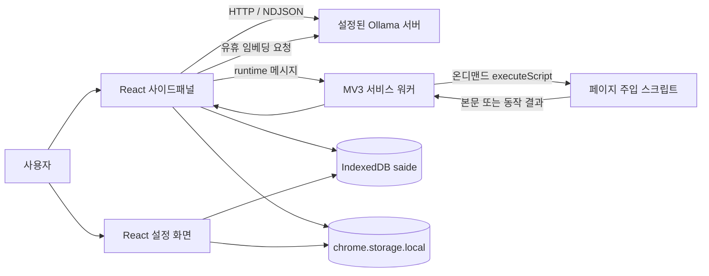

# 현재 아키텍처

기준: 2026-09-20 · 0.1.0. 이 문서는 현재 코드를 설명하며 개선 설계는 [분석 보고서](PROJECT_REVIEW.md)를 따른다.

## 실행 주체와 데이터 흐름

| 경계 | 파일 | 책임 |
|---|---|---|
| 확장 manifest·빌드 | `wxt.config.ts` | Chrome MV3, 권한, 단축키, React/Tailwind 설정 |
| 패널 | `src/entrypoints/sidepanel/App.tsx` | 현재 탭, 프리셋, 권한 요청, health, memory 큐 |
| 대화 상태 | `src/lib/chat/store.ts` | 메시지 저장, 스트리밍, 첨부, 승인 대기, 중단 |
| 모델 전송 | `src/lib/ollama/{client,stream,errors}.ts` | REST, NDJSON, 성능 수집, 오류 분류 |
| 워커 | `src/entrypoints/background.ts` | 탭·우클릭 이벤트, 요청 검증·취소, 주입·캡처 라우팅 |
| 브라우저 보호 | `src/lib/browser/{guards,approval}.ts` | sender/payload·캡처 대상 검사, 문서별 일회용 승인 토큰 |
| 주입 코드 | `src/entrypoints/injected.ts` | Readability/innerText/자막 추출, PDF 원본 수신, DOM 조작 |
| 도구 | `src/lib/agent/{tools,loop,executor}.ts` | 8종 스키마, 승인·반복 제한, 브라우저 실행 어댑터 |
| 메모리 | `src/lib/memory/{queue,store,recall}.ts` | 유휴 임베딩, 청크 저장, 코사인 검색, 근거 프롬프트 |
| 일정 | `src/lib/schedule/*` | 항목·기한 파서, 달력 계산, 자연어 의도 분류, 알람 알림, CSV/ICS |
| 구조화 추출 | `src/lib/ai/action-card.ts` | JSON 스키마 구속, 원문 대조 검증, 기한 보정 |
| 분석 캐시 | `src/lib/cache/doc-results.ts` | 문서 정체성·본문 해시 키, 상한 300건 |
| 정확도 기록 | `src/lib/feedback/store.ts` | 맞음·틀림 누적, 대상별 집계, 외부 전송 없음 |
| PDF | `src/lib/extract/pdf-*.ts`, `src/entrypoints/offscreen/` | 프레임에서 원본 수신 → 오프스크린 pdf.js 해석 |
| 탭 추적 | `src/lib/browser/panel-sync.ts` | 팝업 부모 추적, 무시/추종/전환 판정 |
| 표현 | `src/lib/{i18n,brand,markdown*}` | ko/en 카탈로그, 토큰, 정제된 Markdown/지연 하이라이트 |

LLM 호출은 서비스 워커가 아닌 패널 문서에서 수행한다. 따라서 패널을 닫아도 백그라운드에서 AI 작업이 계속된다고 기대하면 안 된다. 설정 페이지는 독립 문서이며 동일한 chrome.storage/IndexedDB를 공유하지만 React/Zustand 모듈 인스턴스는 별도다.

## 컨텍스트 구성

대화에는 **문맥 경계**(`contextFrom`)가 있다. 본문을 새로 붙이거나 떼면 경계가 그 시점으로 옮겨 가고, 그보다 앞선 문답은 화면에 남되 모델 전송 문맥에서 빠진다. 앞 문서 요약이 다음 문서 답변에 섞이는 것과 좁은 문맥을 함께 막는다.

일반 대화는 시스템 메시지 → 첨부 본문/이미지 블록 → 고정 확인 응답 → 대화 이력 순서다. 안정적인 접두사로 캐시 활용을 돕고 이전 thinking은 입력에 넣지 않는다. 오래된 메시지를 제외한 뒤 전송 경계에서 전체 메시지·도구 스키마·호출·이미지 비용을 다시 추정한다. numCtx의 70%를 넘으면 HTTP 전송을 거부한다. pinned 본문 자동 축약은 아직 없으며 토큰 추정은 tokenizer 보장이 아니다.

에이전트는 별도 시스템 지침과 도구 스키마를 사용하고 턴당 하나만 실행한다. 클릭·입력·이동은 PREPARE → 사용자 승인 → 토큰 소비/재검증 → 실행 순서다. 이동도 content 문서에서 승인 검증 후 location.assign으로 수행한다. 도구 결과는 태그로 감싸고 이미지는 user 메시지로 넣는다. tools/vision 지원을 확인하고 매 후속 턴도 전송 예산을 검사한다. 모델 무응답 감시와 별도로 도구·대상 확인은 15초 제한이다.

## 저장 계약

| 저장소 | 항목 | 수명 |
|---|---|---|
| `chrome.storage.local` | `saide.settings`, 사용자 프리셋, `saide.taskAlertOn`(마지막 알림 날짜), `saide.onboardingSeen` | 명시 변경 또는 확장 데이터 제거 |
| IndexedDB `saide`, version 4 | conversations, messages | 사용자 삭제까지, 자동 대화 만료 없음. v1 테이블 보존 |
| 같은 DB tasks (v3) | 일정 항목·기한·근거·출처 | 대화와 별도 수명. 대화를 지워도 남는다 |
| 같은 DB docResults (v4) | 분석 결과 캐시. 키는 `정체성::명령::지시문·모델 해시` | 상한 300건, 오래된 것부터 정리 |
| 같은 DB feedback (v4) | 맞음·틀림 평가. 문서 제목을 담지 않는다 | 사용자가 지울 때까지 |
| 같은 DB memoryControl | policy epoch·enabled·excluded | 삭제/제외/끄기와 늦은 저장을 직렬화 |
| 같은 DB pageVectors | URL·제목·본문 청크·Float32Array·모델·시각 | 설정 보관 기간/삭제. 정리는 패널 시작·기억 설정 화면 열기·보관 기간 변경 시이며 기억 활성화 여부와 무관 |
| 패널 메모리 | 첨부 본문·화면, 요청 상태, 임베딩 대기 | 패널 종료/대화 전환 등 |

대화는 첫 전송 시 생성한다. 탭 ID와 fragment를 제외한 문서 URL로 기존 대화를 찾는다. 최근 대화 목록은 50건, 성능 집계는 최근 최대 500개 메시지에서 표본을 가져온다. 이 제한은 전체 저장 개수 제한이 아니다.

메모리는 opt-in이며 패널에 첨부한 본문만 대상이다. 약 8초 유휴 후 최대 20건 큐에서 처리하며 한 페이지 최대 4개·각 약 400토큰 청크를 만든다. 같은 URL은 덮어쓴다. 저장 트랜잭션에서 작업 세대·최신 정책을 확인하고 삭제·제외·끄기 이전에 시작된 작업은 저장하지 않는다. `/기억`은 모델 이름·차원·보관 기간·제외 도메인·유사도 0.2를 검사해 상위 최대 5개 URL, 각 400자를 사용한다. 전용 벡터 인덱스는 없으며 전체 순회다.

대화 로드·첨부·생성은 각각 작업 세대로 결과 반영 권한을 검사한다. 임시 응답 ID는 요청별로 다르다. 메시지 저장과 부모 대화 존재 확인은 같은 트랜잭션이다. 설정 저장은 Web Locks로 확장 문서 간 직렬화하고 storage.onChanged로 동기화한다. JSON 기본 15초/embed 180초를 적용한다. 일반 스트림의 180초 무수신 제한은 **첫 바이트가 온 뒤부터** 센다 — CPU 추론의 프리필 침묵은 실패가 아니라 정상 동작이고 본문이 길수록 길어지므로, 그것을 세면 긴 페이지를 붙인 정상 요청이 늘 끊긴다. 잡는 것은 흐르다 멈춘 연결이다. 에이전트 턴의 무응답 시계도 같은 규칙이다. 워커 요청 마감은 180초다.

## 권한 및 보안 경계

`alarms`·`notifications`는 기한 알림, `webNavigation`은 팝업의 부모 탭 추적, `offscreen`은 PDF 해석에 쓴다. 알림은 하루 한 번이고 설정에서 끌 수 있다.

설치 시 localhost/127.0.0.1:11434 호스트만 선언한다. 일반 사이트는 optional host 권한으로 사용자 동작 시 요청한다. 에이전트 시작은 해당 사이트 권한을 확보하며, `screenshot` 실행 중에는 권한을 추가 요청하지 않는다. 화면 첨부 경로는 `<all_urls>`를 요청한다.

페이지·자막·모델 출력은 신뢰할 수 없는 데이터다. 프롬프트 태그와 지침은 모델 판단을 유도할 뿐 보안 경계를 완성하지 않는다. 행동 승인, URL 제한, DOMPurify allowlist가 별도 방어다. 모델이 출력한 이미지는 Markdown allowlist에서 허용하지 않는다. 원격 endpoint를 설정할 수 있으므로 “로컬 전용”을 코드가 강제하는 것은 아니다.

워커는 extension 문서 sender와 런타임 payload를 검증한다. content의 승인 토큰은 URL·동일 노드·행동 인자·요소/폼/링크 속성을 묶고 120초 내 한 번만 소비한다. 취소는 패널 대기를 종료하고 워커/content로 전달하지만 이미 완료된 DOM 동작을 되돌리지 않는다. 실제 확장 E2E 및 같은 노드의 이벤트 핸들러·서버 의미 변화 검증은 남아 있다. 자세한 경계는 [R01~R05](PROJECT_REVIEW.md)를 참고한다.

## 개발 의존성과 문서용 환경

React 19, TypeScript 7, WXT 0.21, Vite 8 기반이다. 정확한 설치 버전은 package-lock.json이 기준이다. 문서용 `docs/preview`는 소스 UI를 가져와 API와 데이터만 fixture로 대체한다. `scripts/docs-preview.mjs`가 loopback 4175 포트에서 실행하며 WXT의 srcDir/entrypoint 밖에 있어 확장에 포함되지 않는다. 제품 데이터나 사용자의 Chrome 프로필을 재사용하지 않는다.
