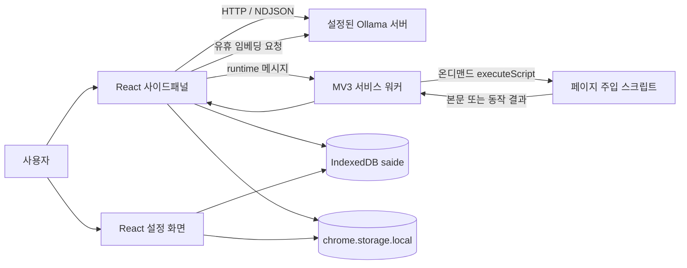

# 현재 아키텍처

기준: 2026-09-12 · 0.1.0. 이 문서는 현재 코드를 설명하며 개선 설계는 [분석 보고서](PROJECT_REVIEW.md)를 따른다.

## 실행 주체와 데이터 흐름

| 경계 | 파일 | 책임 |
|---|---|---|
| 확장 manifest·빌드 | `wxt.config.ts` | Chrome MV3, 권한, 단축키, React/Tailwind 설정 |
| 패널 | `src/entrypoints/sidepanel/App.tsx` | 현재 탭, 프리셋, 권한 요청, health, memory 큐 |
| 대화 상태 | `src/lib/chat/store.ts` | 메시지 저장, 스트리밍, 첨부, 승인 대기, 중단 |
| 모델 전송 | `src/lib/ollama/{client,stream,errors}.ts` | REST, NDJSON, 성능 수집, 오류 분류 |
| 워커 | `src/entrypoints/background.ts` | 탭·우클릭 이벤트, 본문 추출/행동 요청, 캡처·이동 |
| 주입 코드 | `src/entrypoints/injected.ts` | Readability/innerText/자막 추출, DOM 조작 |
| 도구 | `src/lib/agent/{tools,loop,executor}.ts` | 8종 스키마, 승인·반복 제한, 브라우저 실행 어댑터 |
| 메모리 | `src/lib/memory/{queue,store,recall}.ts` | 유휴 임베딩, 청크 저장, 코사인 검색, 근거 프롬프트 |
| 표현 | `src/lib/{i18n,brand,markdown*}` | ko/en 카탈로그, 토큰, 정제된 Markdown/지연 하이라이트 |

LLM 호출은 서비스 워커가 아닌 패널 문서에서 수행한다. 따라서 패널을 닫아도 백그라운드에서 AI 작업이 계속된다고 기대하면 안 된다. 설정 페이지는 독립 문서이며 동일한 chrome.storage/IndexedDB를 공유하지만 React/Zustand 모듈 인스턴스는 별도다.

## 컨텍스트 구성

일반 대화는 시스템 메시지 → 첨부 본문/이미지 블록 → 고정 확인 응답 → 대화 이력 순서다. 안정적인 접두사로 Ollama의 캐시 활용을 돕는다. 이전 thinking은 다시 모델 입력에 넣지 않는다. 입력 추정 예산은 컨텍스트의 70%이며 오래된 메시지부터 제외한다. pinned 블록과 최신 메시지가 예산보다 큰 경우의 강제 상한은 아직 없다.

에이전트는 별도 시스템 지침과 도구 스키마를 사용한다. 모델이 여러 도구를 내놓아도 턴당 하나만 실행한다. 클릭·입력·이동은 승인 후 실행한다. 성공/실패 결과는 태그로 감싸 도구 메시지로 넣고 이미지는 user 메시지로 넣는다. 모델 무응답 제한과 실행 제한의 구현상 차이는 R02를 참고한다.

## 저장 계약

| 저장소 | 항목 | 수명 |
|---|---|---|
| `chrome.storage.local` | `saide.settings`, 사용자 프리셋 | 명시 변경 또는 확장 데이터 제거 |
| IndexedDB `saide`, version 1 | conversations, messages | 사용자 삭제까지, 자동 대화 만료 없음 |
| 같은 DB pageVectors | URL·제목·본문 청크·Float32Array·모델·시각 | 설정 보관 기간/삭제, 정리는 패널 시작 시 |
| 패널 메모리 | 첨부 본문·화면, 요청 상태, 임베딩 대기 | 패널 종료/대화 전환 등 |

대화는 첫 전송 시 생성한다. 탭 ID와 fragment를 제외한 문서 URL로 기존 대화를 찾는다. 최근 대화 목록은 50건, 성능 집계는 최근 최대 500개 메시지에서 표본을 가져온다. 이 제한은 전체 저장 개수 제한이 아니다.

메모리는 opt-in이며 패널에 첨부한 본문만 대상이다. 약 8초 유휴 후 최대 20건 큐에서 처리하며, 한 페이지 최대 4개·각 약 400토큰 청크를 만든다. 같은 URL은 덮어쓴다. `/기억` 요청 때만 질의 임베딩과 검색을 수행하고 모델 문자열별 상위 최대 5개 URL, 각 400자 발췌를 프롬프트에 넣는다. 전용 벡터 인덱스는 없으며 전체 순회다.

## 권한 및 보안 경계

설치 시 localhost/127.0.0.1:11434 호스트만 선언한다. 일반 사이트는 optional host 권한으로 사용자 동작 시 요청한다. 에이전트 시작은 해당 사이트 권한을 확보하며, `screenshot` 실행 중에는 권한을 추가 요청하지 않는다. 화면 첨부 경로는 `<all_urls>`를 요청한다.

페이지·자막·모델 출력은 신뢰할 수 없는 데이터다. 프롬프트 태그와 지침은 모델 판단을 유도할 뿐 보안 경계를 완성하지 않는다. 행동 승인, URL 제한, DOMPurify allowlist가 별도 방어다. 모델이 출력한 이미지는 Markdown allowlist에서 허용하지 않는다. 원격 endpoint를 설정할 수 있으므로 “로컬 전용”을 코드가 강제하는 것은 아니다.

알려진 공백: 실행 직전 대상 재검증, 메시지 런타임 검증, 실제 실행기의 취소, 데이터 삭제 경합. [R01~R05](PROJECT_REVIEW.md)를 출시 전 우선 검토한다.

## 개발 의존성과 문서용 환경

React 19, TypeScript 7, WXT 0.21, Vite 8 기반이다. 정확한 설치 버전은 package-lock.json이 기준이다. 문서용 `docs/preview`는 소스 UI를 가져와 API와 데이터만 fixture로 대체한다. `scripts/docs-preview.mjs`가 loopback 4175 포트에서 실행하며 WXT의 srcDir/entrypoint 밖에 있어 확장에 포함되지 않는다. 제품 데이터나 사용자의 Chrome 프로필을 재사용하지 않는다.
